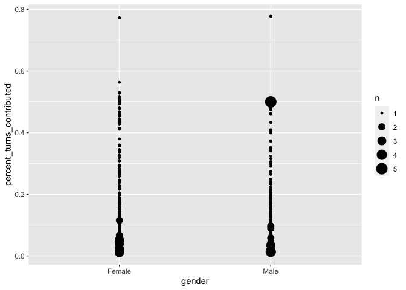
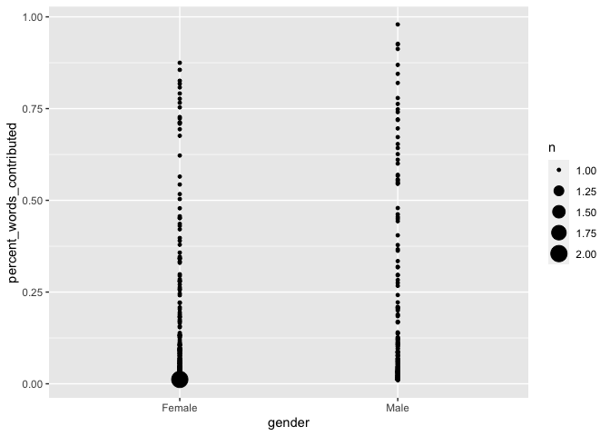

Data-processing Pipeline
================
Jack Rechsteiner
03/15/2024

- [Data overview](#data-overview)
- [Data pipeline](#data-pipeline)
  - [Initial data cleaning](#initial-data-cleaning)
- [Creating a word token data frame](#creating-a-word-token-data-frame)
  - [Counting instances of non-lexicals, backchannels, and
    exclamations](#counting-instances-of-non-lexicals-backchannels-and-exclamations)
- [Turn-taking analysis](#turn-taking-analysis)
- [Word count analysis](#word-count-analysis)
- [Session Info](#session-info)

``` r
##Set knitr options (show both code and output, show output w/o leading #)
knitr::opts_chunk$set(echo = TRUE, include = TRUE, comment=NA)

#load tidyverse
library("tidyverse")
```

    ## ── Attaching core tidyverse packages ──────────────────────── tidyverse 2.0.0 ──
    ## ✔ dplyr     1.1.4     ✔ readr     2.1.4
    ## ✔ forcats   1.0.0     ✔ stringr   1.5.1
    ## ✔ ggplot2   3.4.4     ✔ tibble    3.2.1
    ## ✔ lubridate 1.9.3     ✔ tidyr     1.3.0
    ## ✔ purrr     1.0.2     
    ## ── Conflicts ────────────────────────────────────────── tidyverse_conflicts() ──
    ## ✖ dplyr::filter() masks stats::filter()
    ## ✖ dplyr::lag()    masks stats::lag()
    ## ℹ Use the conflicted package (<http://conflicted.r-lib.org/>) to force all conflicts to become errors

``` r
#load xml2
library(xml2)
```

# Data overview

The data used in this project comes from the [Michigan Corpus of
Academic Spoken English](https://quod.lib.umich.edu/cgi/c/corpus/corpus)
(MICASE) which contains transcripts of academic speech events recorded
at the University of Michigan in the late 1990s and early 2000s. The
transcripts are available as XML files which contain metadata on the
speech event and the participants involved, as well as the entire
transcript. This metadata includes information on the type of speech
event, the primary discourse mode, the level of interactivity,the number
of participants and speakers, the English language proficiency of
speakers, the academic roles of participants, and the gender and age
group for each speaker. Specifically, this project works with the 75
interactions that are categorized within MICASE as “Highly interactive”
or “Mostly interactive”. These 75 transcripts represent roughly 6,360
minutes of recorded speech interactions.

# Data pipeline

The code presented here reads in the 75 XML files for this project and
then extracts data from the nested structure of the XML files, so that
it can be input into a tibble that will be used for analysis.

``` r
#Creating a list of file names to be iterated over read_xml() with map()
file_list <- list.files("Data", pattern="*.xml", full.names=TRUE)

#Using map() to create a list from reading in all the XML files
xml_list <- map(file_list, read_xml)

#Creating a list of all the file names from xml_list
##which are tagged as an "ID" attribute in the XML files
filename_list <- map(xml_list,
                     ~xml_attr(.x, "ID"))

#Creating a list of all the speechevent labels from xml_list
##by finding all the terms with 'speechevent' type and extracting the text
speechevent_list <- map(xml_list,
                        ~xml_find_all(.x, "//TERM[@TYPE='SPEECHEVENT']") %>% 
                          xml_text())

#Getting all the first-level utterance nodes from the BODY nodes in xml_list
speaker_list <- map(xml_list,
                    ~xml_find_all(.x, xpath="//BODY//U1"))

#Getting all the second-level speaker nodes as a separate element 
u2_speaker_list <- map(speaker_list,
                       ~xml_find_all(.x, xpath="//U1//U2"))

#Copying speaker_list because xml_remove() overwrites its input
u1_speaker_list <- speaker_list

#Using walk() to remove second-level speaker nodes from u1_speaker_list
##without printing the output of the function
walk(u1_speaker_list,
     ~ xml_remove(xml_find_all(.x, xpath="//U1//U2")))

#Turning speaker node attributes into chr lists for u1_speaker_list and u2_speaker_list
u1_speaker_nodes <- map(u1_speaker_list,
                        ~xml_attrs(.x))
u2_speaker_nodes <- map(u2_speaker_list,
                        ~xml_attrs(.x))

#Getting text content from speaker nodes for u1_speaker_list and u2_speaker_list
u1_speaker_text <- map(u1_speaker_list,
                       ~xml_text(.x))
u2_speaker_text <- map(u2_speaker_list,
                       ~xml_text(.x))

#Creating tibble with the columns:
##'file' using the filename string in filename_list
micase_df <- tibble(file = filename_list, 
                    ##'speechevent' using the speechevent string in speechevent_list
                    speech_event = speechevent_list, 
                    ##'level' to indicate whether it is a first-level or second-level utterance
                    level = "u1", 
                    ##'nodeset' which contains the lists of attributes for speakers
                    nodeset = u1_speaker_nodes, 
                    ##'text' which contains the text from the speaker
                    text = u1_speaker_text) %>% 
  #Using add_row() to add the data from the second-level utterances and set the level to "u2"
  add_row(file = filename_list, 
          speech_event = speechevent_list, 
          level = "u2", 
          nodeset = u2_speaker_nodes, 
          text = u2_speaker_text) %>% 
  #Using unnest() on the columns that contain lists created by map()
  unnest(cols = c(file, speech_event, nodeset, text)) %>% 
  #Giving each entry a unique_id based on row_number()
  mutate(unique_id = row_number(), .before=1) %>% 
  #Using unnest_wider() on the nodeset lists so that the XML attribute titles become columns 
  ##which are filled with the XML attribute values
  unnest_wider(nodeset)

#Renaming columns to be more transparent
micase_df <- micase_df %>% 
  rename(speaker_id = WHO, 
         native_english_status = NSS, 
         academic_role = ROLE, 
         gender = SEX, 
         age_range = AGE, 
         first_language = FLANG) %>% 
  #Replacing value codes with full value names
  mutate(across(speech_event, ~ (str_replace_all(.x, c("ADV" = "Advising Session", 
                                                       "COL" = "Colloquium", 
                                                       "DEF" = "Dissertation Defense", 
                                                       "DIS" = "Discussion Section", 
                                                       "INT" = "Interview", 
                                                       "LAB" = "Lab Section",
                                                       "LEL" = "Large Lecture",
                                                       "LES" = "Small Lecture",
                                                       "MTG" = "Meeting",
                                                       "OFC" = "Office Hours",
                                                       "SEM" = "Seminar",
                                                       "SGR" = "Study Group",
                                                       "STP" = "Student Presentation",
                                                       "SVC" = "Service Encounter",
                                                       "TOU" = "Tour")))),
         across(native_english_status, ~ (str_replace_all(.x, c("^NS$" = "American Speaker",
                                                                "NSO" = "Non-American Speaker",
                                                                "NRN" = "Near Native Speaker",
                                                                "NNS" = "Non-Native Speaker")))),
         #to simplify the categories in the eventual analysis, differences between "junior" and "senior" roles are dropped
         ##for instance, "JU" is code for "junior undergrad" and "SU" is code for "senior undergrad",
         ##but this analysis combines these two categories into "undergrad"
         across(academic_role, ~ (str_replace_all(.x, c("JU" = "Undergrad",
                                                        "SU" = "Undergrad",
                                                        "JG" = "Grad",
                                                        "SG" = "Grad",
                                                        "JF" = "Faculty",
                                                        "SF" = "Faculty",
                                                        "RE" = "Researcher",
                                                        "PD" = "Post-doc",
                                                        "ST" = "Staff",
                                                        "VO" = "Visitor/Other",
                                                        "UN" = "Unknown")))),
         across(gender, ~ (str_replace_all(.x, c("F" = "Female",
                                                 "M" = "Male",
                                                 "U" = "Unknown")))),
         across(age_range, ~ (str_replace_all(.x, c("^1$" = "17-23",
                                                    "^2$" = "24-30",
                                                    "^3$" = "31-50",
                                                    "^4$" = "51+",
                                                    "^0$" = "Unknown"))))
  )

#Brief samples of the current data frame
head(micase_df)
```

    # A tibble: 6 × 12
      unique_id file        speech_event     level speaker_id native_english_status
          <int> <chr>       <chr>            <chr> <chr>      <chr>                
    1         1 adv700ju023 Advising Session u1    S1         Near Native Speaker  
    2         2 adv700ju023 Advising Session u1    S2         American Speaker     
    3         3 adv700ju023 Advising Session u1    S1         Near Native Speaker  
    4         4 adv700ju023 Advising Session u1    S2         American Speaker     
    5         5 adv700ju023 Advising Session u1    S1         Near Native Speaker  
    6         6 adv700ju023 Advising Session u1    S2         American Speaker     
    # ℹ 6 more variables: academic_role <chr>, gender <chr>, age_range <chr>,
    #   RESTRICT <chr>, first_language <chr>, text <chr>

``` r
tail(micase_df)
```

    # A tibble: 6 × 12
      unique_id file        speech_event level speaker_id native_english_status
          <int> <chr>       <chr>        <chr> <chr>      <chr>                
    1     53747 tou999ju030 Tour         u2    SU-m       American Speaker     
    2     53748 tou999ju030 Tour         u2    SU-m       American Speaker     
    3     53749 tou999ju030 Tour         u2    SU-m       American Speaker     
    4     53750 tou999ju030 Tour         u2    SU-m       American Speaker     
    5     53751 tou999ju030 Tour         u2    R1         American Speaker     
    6     53752 tou999ju030 Tour         u2    SU-m       American Speaker     
    # ℹ 6 more variables: academic_role <chr>, gender <chr>, age_range <chr>,
    #   RESTRICT <chr>, first_language <chr>, text <chr>

The file name is included in the data frame so that each utterance can
be connected to the transcription that it came from. The type of speech
event is included so that the data can be analyzed for potential
differences in speech contributions across speech event types. All
speaker information provided by the transcript is retained in the data
frame. Indications of overlapping speech are not included in the data
frame in order to keep the data tidy. Indications of overlaps may be
added at a later time if deemed relevant enough to the analysis to be
included. The decision to separate the utterances into two levels of
utterances is based on the structure of the MICASE transcriptions where
U1 nodes represent a speaker taking a full conversation turn and U2
nodes represent a speaker responding verbally without taking a full
conversation turn.

## Initial data cleaning

Separating the two utterance levels caused “/n” strings to be created in
first-level utterances at positions where second-level utterances were
originally nested. These strings should be removed as they are not part
of the data being analyzed. Additionally, the [MICASE
Manual](https://ca.talkbank.org/access/0docs/MICASE.pdf) explains in
Table 3-2 that words that were “completely unintelligible” were
transcribed as two x’s in parentheses. These will also be removed from
the data, as it is difficult to quantify the conversational contribution
of a word or words that are not known. It was also discovered that
participants who have values “ALL” or “CITE” values in `RESTRICT` have
had their speech redacted from the corpus. Due to this, these restricted
utterances will also be removed from the dataset. The MICASE manual also
states that utterances with an “SS” value in the `WHO` column are from
two or more speakers in unison, which makes it difficult to link these
contributions to specific speakers. As such, these utterances will be
removed.

``` r
#saving changes to a new df so that the original is still around if I need it
micase_df_turns <- micase_df %>% 
  #mutating across the text column to replace whitespace at the beginning and end of lines with nothing,
  #all other whitespace with a single space, all "\n" with nothing, and all "(xx)" with nothing
  mutate(across(text, ~ (str_replace_all(.x, c("^\\s" = "", "\\s$" = "", "\\s+" = " ", "\\n" = "", "\\(xx\\)" = ""))))) %>% 
  #removing all text cells that contain "RESTRICTED" values
  filter(text != "RESTRICTED") %>% 
  #dropping the RESTRICT column because it is not informative with the "RESTRICTED" values removed
  select(!RESTRICT) %>% 
  #removing all rows with speaker_id cells that contain "SS" values
  filter(speaker_id != "SS")
```

# Creating a word token data frame

The current data frame is structured in a way that is useful to analyze
turn-taking among conversational participants. In addition to this, a
longer data frame will be created where each word token has its own cell
in the data frame in order to analyze the number of words spoken by each
conversation participant.

``` r
micase_df_words <- micase_df_turns %>% 
  #split the strings in the text column by whitespace
  mutate(across(text, ~ (strsplit(.x, "\\s")))) %>% 
  #unnest the column so that every word is its own cell
  unnest(cols=c("text")) %>% 
  #remove any rows with empty "text" cells
  filter(text != "")
```

## Counting instances of non-lexicals, backchannels, and exclamations

The MICASE Manual lists all the transcription conventions used for
hesitation and filler words, backchannel cues, exclamations, and
truncated words which allows all these instances to be counted in a
straightforward way. Getting counts of these phenomena will be helpful
in guiding how the analysis handles them.

``` r
#concatenating the regexs to be mapped over to find hesitations, backchannels, exclamations, and truncations
nonlexical_regexs <- c(hesitation = "^(hm|hm'|huh|mm|mhm|uh|um|mkay)[^\\w\\s]?$", 
                       backchannel = "^(okey-doke|okey-dokey|uhuh|yeah|yep|yuhuh|uh'uh|huh'uh|'m'm|huh'uh)[^\\w\\s]?$", 
                       exclamation = "^(ach|ah|ahah|gee|jeez|oh|ooh|oop|oops|tch|ugh|uh'oh|whoa|yay)[^\\w\\s]?$", 
                       truncated = "-[^\\w\\s]?$")

#saving a count of the total cells in micase_df_words
total_word_count <- sum(micase_df_words %>% count())

#creating a word counter function that takes a regex string as input
word_counter <- function(regex_string) {
  micase_df_words %>% 
    #filtering micase_df_words based on cells in the text column that match the regex string
    filter(str_detect(text, regex_string)) %>% 
    #getting a count of the words matched
    count() %>% 
    #creating a column for the percentage of the total word count that are matched strings
    mutate(percentage_of_total = sum(n)/total_word_count)
}

#mapping the concatenated regex strings over the word_counter() function
map_dfr(nonlexical_regexs, word_counter, .id = "category")
```

    # A tibble: 4 × 3
      category        n percentage_of_total
      <chr>       <int>               <dbl>
    1 hesitation  20861             0.0224 
    2 backchannel  9413             0.0101 
    3 exclamation  3678             0.00395
    4 truncated   10859             0.0117 

Based on these total counts, exclamations will be removed from the data
frame because they represent less than one percent of the total data.
These word counts are being used as a quantifiable proxy for a speaker’s
level of engagement with a speech event, so truncated words,
hesitations, and filler words will also be removed but backchannel cues
will be retained.

``` r
micase_df_words <- micase_df_words %>% 
  #using filter() to select every row that does not match the three regex strings
  filter(!str_detect(text, nonlexical_regexs["hesitation"]),
         !str_detect(text, nonlexical_regexs["exclamation"]),
         !str_detect(text, nonlexical_regexs["truncated"]))
```

# Turn-taking analysis

Examining contributions in academic interactions by the number of turns
taken will be accomplished with the `micase_df_turns` dataframe that has
been created. The MICASE Manual describes utterances tagged as
second-level as “Backchannel cues from a speaker who doesn’t hold the
floor and unsuccessful attempts to take the floor” (p. 14), so the
initial analysis will only focus on first-level utterances which
represent speakers successfully taking the floor.

``` r
#creating a new df for the analysis of the turn data
micase_turn_analysis <- micase_df_turns %>% 
  #filtering to just look at first-level utterances
  filter(level == "u1") %>% 
  #adding count column for total turns taken in event
  add_count(file, name = "event_turn_total") %>% 
  #using group_by to organize turns according to the file they come from and the speaker_id
  group_by(file, speaker_id) %>% 
  #adding count column for all turns taken by each speaker in every file
  add_count(name = "speaker_turns") %>% 
  #adding column calculating the the percentage of turns contributed by each speaker in every event
  mutate(percent_turns_contributed = speaker_turns/event_turn_total) %>% 
  #dropping columns that aren't relevant to analysis
  select(-c(unique_id, level, text)) %>% 
  #using slice to select the first row of each group
  ##essentially providing a single row for each speaker in every interaction
  ##while still retaining the metadata information for the speaker
  slice(1) %>% 
  #filtering out speakers who contributed less than 1% of words to event
  filter(percent_turns_contributed >= 0.01)

micase_turn_analysis %>% 
  #filtering out speakers with unknown gender
  filter(gender != "Unknown") %>% 
  #creating geom_count() plot with 'gender' on the x-axis and percent_turns_contributed on the y-axis
  ggplot(aes(x = gender, y = percent_turns_contributed)) + 
  geom_count()
```

<!-- -->

``` r
#A very preliminary linear model to see the effect that speech_event has on percent_turns_contributed
lm(percent_turns_contributed ~ speech_event, data = micase_turn_analysis) %>% 
  summary()
```


    Call:
    lm(formula = percent_turns_contributed ~ speech_event, data = micase_turn_analysis)

    Residuals:
         Min       1Q   Median       3Q      Max 
    -0.21061 -0.07177 -0.04391  0.02968  0.63447 

    Coefficients:
                                      Estimate Std. Error t value Pr(>|t|)    
    (Intercept)                       0.180952   0.039041   4.635 4.38e-06 ***
    speech_eventColloquium           -0.092586   0.055212  -1.677  0.09408 .  
    speech_eventDiscussion Section   -0.103808   0.043122  -2.407  0.01637 *  
    speech_eventDissertation Defense -0.032088   0.048605  -0.660  0.50940    
    speech_eventInterview             0.319048   0.065715   4.855 1.54e-06 ***
    speech_eventLab Section          -0.009013   0.043459  -0.207  0.83578    
    speech_eventLarge Lecture        -0.119808   0.046076  -2.600  0.00955 ** 
    speech_eventMeeting              -0.071260   0.042901  -1.661  0.09723 .  
    speech_eventOffice Hours         -0.037646   0.041195  -0.914  0.36116    
    speech_eventSeminar              -0.072007   0.042833  -1.681  0.09326 .  
    speech_eventService Encounter    -0.047151   0.053046  -0.889  0.37443    
    speech_eventSmall Lecture        -0.095942   0.041309  -2.323  0.02054 *  
    speech_eventStudent Presentation -0.104232   0.041383  -2.519  0.01204 *  
    speech_eventStudy Group           0.040906   0.044608   0.917  0.35951    
    speech_eventTour                 -0.075054   0.058198  -1.290  0.19768    
    ---
    Signif. codes:  0 '***' 0.001 '**' 0.01 '*' 0.05 '.' 0.1 ' ' 1

    Residual standard error: 0.1295 on 600 degrees of freedom
    Multiple R-squared:  0.1637,    Adjusted R-squared:  0.1442 
    F-statistic: 8.391 on 14 and 600 DF,  p-value: < 2.2e-16

Examining the results of the linear model for the relationship between
the percentage of turns contributed and the type of speech event shows
potential similarities that may motivate collapsing certain categories.
For instance, the Discussion Section category has an estimate and *p*
value that are similar those for Student Presentation events; from a
conceptual standpoint, it makes sense that these events are similar and
could perhaps be combined into a category of “Student-led Class
Session”.

# Word count analysis

``` r
#creating a new df for the analysis of the turn data
micase_word_analysis <- micase_df_words %>% 
  add_count(file, name = "event_word_total") %>% 
  #using group_by to organize turns according to the file they come from and the speaker_id
  group_by(file, speaker_id) %>% 
  #adding count column for all turns taken by each speaker in every file
  add_count(name = "speaker_words") %>% 
  #adding column calculating the the percentage of turns contributed by each speaker in every event
  mutate(percent_words_contributed = speaker_words/event_word_total) %>% 
  #dropping columns that aren't relevant to analysis
  select(-c(unique_id, text)) %>% 
  #using slice to select the first row of each group
  ##essentially providing a single row for each speaker in every interaction
  ##while still retaining the metadata information for the speaker
  slice(1) %>% 
  #filtering out speakers who contributed less than 1% of words to event
  filter(percent_words_contributed >= 0.01)

micase_word_analysis %>% 
  #creating geom_count() plot with 'gender' on the x-axis and percent_words_contributed on the y-axis
  ggplot(aes(x = gender, y = percent_words_contributed)) + 
  geom_count()
```

<!-- -->

# Session Info

``` r
sessionInfo()
```

    R version 4.3.2 (2023-10-31)
    Platform: x86_64-apple-darwin20 (64-bit)
    Running under: macOS Monterey 12.6.5

    Matrix products: default
    BLAS:   /Library/Frameworks/R.framework/Versions/4.3-x86_64/Resources/lib/libRblas.0.dylib 
    LAPACK: /Library/Frameworks/R.framework/Versions/4.3-x86_64/Resources/lib/libRlapack.dylib;  LAPACK version 3.11.0

    locale:
    [1] en_US.UTF-8/en_US.UTF-8/en_US.UTF-8/C/en_US.UTF-8/en_US.UTF-8

    time zone: America/Detroit
    tzcode source: internal

    attached base packages:
    [1] stats     graphics  grDevices utils     datasets  methods   base     

    other attached packages:
     [1] xml2_1.3.6      lubridate_1.9.3 forcats_1.0.0   stringr_1.5.1  
     [5] dplyr_1.1.4     purrr_1.0.2     readr_2.1.4     tidyr_1.3.0    
     [9] tibble_3.2.1    ggplot2_3.4.4   tidyverse_2.0.0

    loaded via a namespace (and not attached):
     [1] gtable_0.3.4      highr_0.10        compiler_4.3.2    tidyselect_1.2.0 
     [5] scales_1.3.0      yaml_2.3.8        fastmap_1.1.1     R6_2.5.1         
     [9] labeling_0.4.3    generics_0.1.3    knitr_1.45        munsell_0.5.0    
    [13] pillar_1.9.0      tzdb_0.4.0        rlang_1.1.3       utf8_1.2.4       
    [17] stringi_1.8.3     xfun_0.42         timechange_0.2.0  cli_3.6.2        
    [21] withr_2.5.2       magrittr_2.0.3    digest_0.6.35     grid_4.3.2       
    [25] rstudioapi_0.15.0 hms_1.1.3         lifecycle_1.0.4   vctrs_0.6.5      
    [29] evaluate_0.23     glue_1.7.0        farver_2.1.1      fansi_1.0.6      
    [33] colorspace_2.1-0  rmarkdown_2.26    tools_4.3.2       pkgconfig_2.0.3  
    [37] htmltools_0.5.7  
